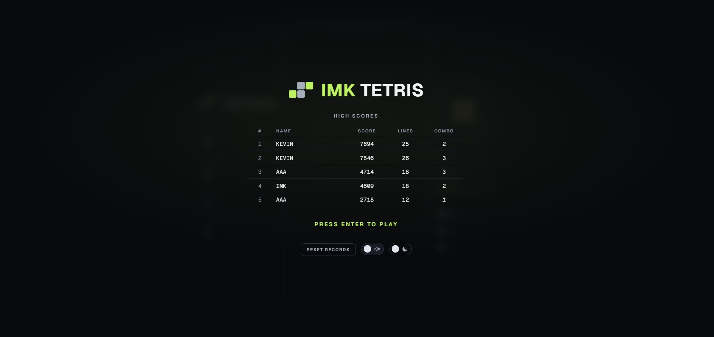
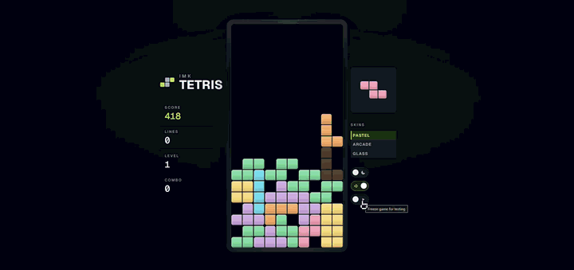
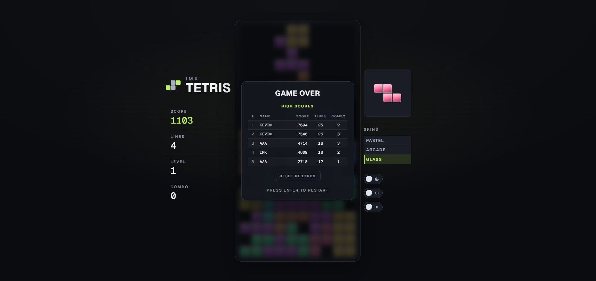

# 🎮 Tetris

> Classic Tetris in vanilla JavaScript — Canvas 2D rendering, synthesized Web Audio, no dependencies, no build step.

🌐 [Leer en español](README.es.md)

<div align="center">

[](https://imkhub1.github.io/imk-tetris/)

</div>

<div align="center">


[](LICENSE)

</div>

<div align="center">

| Start screen | Gameplay | Game Over |
|:---:|:---:|:---:|
|  |  |  |

</div>

## Features

- **10 × 20** board with all 7 standard pieces (I, O, T, S, Z, J, L).
- **Rotation** with wall kicks (±1, ±2 columns near walls).
- **Soft drop** and **Hard drop** (keyboard + mouse click).
- **Ghost piece**, **next piece preview**, and **3-2-1 countdown**.
- **Block skin selector**: Pastel, Arcade, Glass.
- **Scoring**: 100 / 300 / 500 / 800 × level; levels up every 10 lines.
- **High scores** with name entry, persisted in `localStorage`.
- **Audio**: synthesized SFX and background music (menu + gameplay) via Web Audio API — no asset files.
- **Volume control** and **mute** in the pause menu.
- **Light / dark mode** toggle, persisted in `localStorage`.
- **Freeze mode**: suspend gravity without opening the pause overlay.

## Play

> [!TIP]
> No install needed — click the **PLAY NOW** badge above to play instantly in the browser.

To run locally:

```bash
# Python 3
python3 -m http.server 8000

# Node.js
npx serve .
```

Then open `http://localhost:8000`.

> [!NOTE]
> Opening `index.html` directly also works, but a local server avoids browser audio-policy restrictions.

## Controls

| Key | Action |
| --- | ------ |
| `←` / `→` · `A` / `D` | Move horizontally |
| `↑` / `W` · Right-click | Rotate clockwise |
| `↓` / `S` | Soft drop |
| `Space` · Left-click | Hard drop |
| `F` | Freeze (suspend without pause menu) |
| `P` / `Esc` · Middle-click | Pause / resume |
| `Enter` | Start · Pause · Restart (on Game Over) |

The pause menu also lets you set a **starting level** (1–10) before the next game.

## Project structure

```
imk-tetris/
├── assets/          # Screenshots and GIFs for README
├── index.html       # DOM structure and canvas elements
├── style.css        # Retro arcade theme, CSS variables, animations
├── theme-init.js    # Applies saved theme before first render (prevents flash)
├── audio.js         # SFX + synthesized music engine (Web Audio API)
├── game.js          # Full game logic (~460 lines)
└── tests/           # Jest unit tests
```

## Customization

Adjust constants at the top of `game.js`:

| Constant | Meaning | Default |
|----------|---------|---------|
| `COLS` | Board columns | `10` |
| `ROWS` | Board rows | `20` |
| `BLOCK` | Cell size in px | `30` |
| `SKINS` | Color palette per skin | Pastel / Arcade / Glass |
| `LINE_SCORES` | Points for 1–4 lines cleared | `[0, 100, 300, 500, 800]` |

> [!IMPORTANT]
> If you change `COLS`, `ROWS`, or `BLOCK`, also update the `width`/`height` attributes on `<canvas id="board">` in `index.html` to match (`COLS * BLOCK` × `ROWS * BLOCK`).

## Development

```bash
npm install       # install dev dependencies (jest, eslint)
npm test          # run unit tests
npm run lint      # lint with eslint
```
